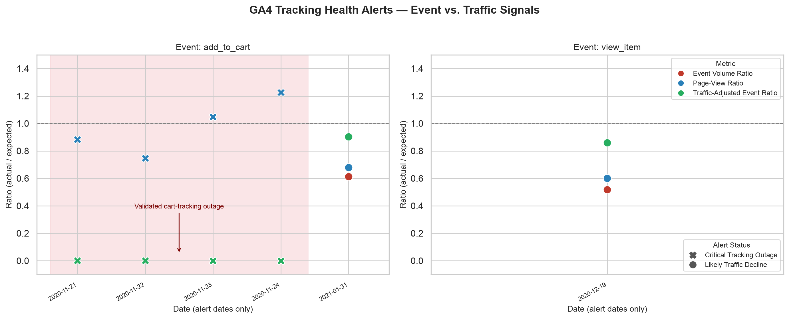
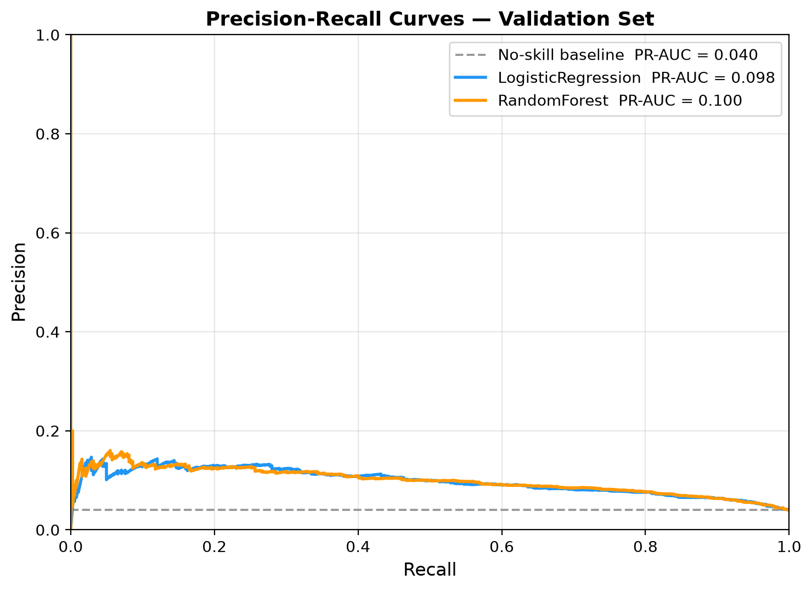
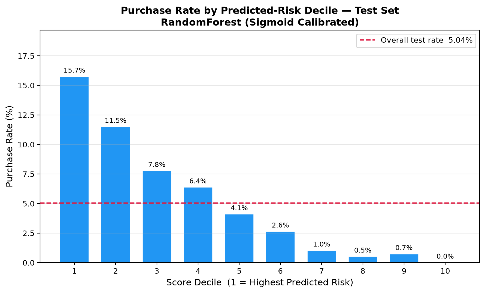
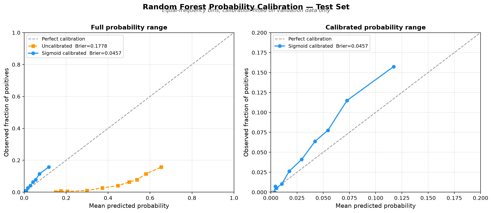

# Google Merchandise Store Conversion Funnel Analysis

## Executive Summary

This project analyzes the public Google Analytics 4 (GA4) e-commerce export from the Google Merchandise Store (November 2020 – January 2021). The analysis covers **4,295,584 GA4 events across 360,129 sessions** and was built entirely with BigQuery SQL and Python.

**Primary ordered funnel** (view_item → begin_checkout → purchase):

| Stage | Sessions | Rate |
|---|---|---|
| Product-view sessions | 77,020 | — |
| Checkout sessions | 10,770 | 13.98% view-to-checkout |
| Purchase sessions | 4,661 | 43.28% checkout-to-purchase |
| **Overall conversion** | | **6.05%** |

**Clean cart funnel** (view_item → add_to_cart → begin_checkout → purchase, restricted to the reliable cart-tracking period):

| Stage | Sessions | Rate |
|---|---|---|
| Product-view sessions | 61,835 | — |
| Cart sessions | 15,145 | 24.49% view-to-cart |
| Checkout sessions | 5,292 | 34.94% cart-to-checkout |
| Purchase sessions | 2,751 | 51.98% checkout-to-purchase |
| **Overall conversion** | | **4.45%** |

**Key findings at a glance:**
- Add-to-cart tracking was unreliable November 1–15 and unavailable November 21–24 despite normal store activity. The four-stage cart funnel is restricted to the reliable tracking period.
- Weekly purchase conversion peaked at **8.93%** during the week beginning December 7, then declined through January.
- Mobile converted at 6.26% vs. 5.91% for desktop — the difference was borderline in statistical tests and small in practical terms.

**V2 — Tracking health monitor:**
- A hybrid GA4 tracking-health monitor detected all four manually validated `add_to_cart` outage dates (November 21–24, 2020).
- Two other event-volume drops — `view_item` on December 19 and `add_to_cart` on January 31 — were classified as `LIKELY_TRAFFIC_DECLINE` because their traffic-adjusted event ratios were 0.860 and 0.903, consistent with site-wide page-view declines rather than event-specific failures.
- This is an offline monitoring prototype built for portfolio demonstration. It is not a deployed production alerting service.

**V3 — Purchase-propensity model:**
- Built a leakage-safe session-level purchase-propensity model on **77,020 product-view sessions** (November 2020 – January 2021).
- Prediction occurs immediately after the session's first `view_item` event; the target is whether a `purchase` event occurs later in that same session.
- Chronological test-set **PR-AUC: 0.1402** versus a 0.0504 no-skill baseline — a 2.8× improvement.
- Highest-risk scoring decile achieved **3.13× lift** and captured **31.2% of purchases**.
- Sigmoid calibration on validation data reduced test Brier score from 0.1778 to **0.0457**, substantially improving probability reliability.
- The model identifies propensity and associations between early-session signals and purchase. It does **not** establish causal effects; controlled experiments are required before taking conversion interventions.

---

## Project overview

This repository contains a reproducible analysis of the Google Merchandise Store's purchase funnel using the public BigQuery GA4 e-commerce dataset. The work identifies where sessions drop out of the funnel, compares conversion across devices and acquisition channels, and flags product opportunities. Queries and notebooks are provided for reproduction. The repository does **not** contain Google Cloud credentials or exported datasets.

---

## Business problem

Online retailers lose revenue when sessions exit the funnel before purchasing. Understanding where abandonment is highest, which channels and devices underperform, and which products attract traffic but not purchases enables targeted experiments and prioritized investment.

**Research questions:**

- Where do the largest drop-offs occur in the purchase funnel?
- Do mobile sessions convert at a meaningfully different rate than desktop sessions?
- Which traffic sources and mediums drive the highest conversion?
- Which products have high traffic but low purchase conversion?
- Can an interpretable model predict the probability of purchase from early-session signals? *(Completed — see V3 findings below.)*

---

## Dataset

**Source:** `bigquery-public-data.ga4_obfuscated_sample_ecommerce.events_*`

GA4 event-level e-commerce data from 2020-11-01 through 2021-01-31. Data is an obfuscated sample from the real Google Merchandise Store. All queries use `_TABLE_SUFFIX` filtering to limit data scanned and cost.

**Scale:** 4,295,584 events · 360,129 sessions · 3 months

---

## Technology stack

- **BigQuery** (GoogleSQL) — all funnel and product queries
- **Python 3** — statistical analysis and visualization
- **pandas · numpy · matplotlib · seaborn · scipy · statsmodels · scikit-learn · jupyter**
- **Looker Studio / Tableau / Power BI** — dashboard (planned)

**BigQuery access and billing:**
- BigQuery Sandbox allows free queries against public datasets without a credit card, subject to quota limits. See https://cloud.google.com/bigquery/docs/sandbox.
- The minimum IAM role needed to run queries is `roles/bigquery.jobUser`. `BigQuery Data Editor` is only required if you create tables in your own dataset.

---

## Repository structure

```
google-store-funnel-analysis/
├── README.md
├── requirements.txt
├── .gitignore
├── sql/                            ← BigQuery queries — run in order 00 → 13
│   ├── 00_schema_inspection.sql
│   ├── 01_data_exploration.sql
│   ├── 02_data_quality.sql
│   ├── 03_user_funnel.sql
│   ├── 04_session_funnel.sql
│   ├── 05_ordered_session_funnel.sql
│   ├── 06_device_analysis.sql
│   ├── 07_traffic_source_analysis.sql
│   ├── 08_product_analysis.sql
│   ├── 09_model_features.sql           ← Leakage-safe session features (V3) ✓
│   ├── 10_dashboard_tables.sql
│   ├── 11_weekly_conversion_trend.sql
│   ├── 12_tracking_health_monitor.sql
│   └── 13_model_feature_validation.sql ← Feature validation checks (V3) ✓
├── notebooks/
│   ├── 01_statistical_analysis.ipynb   ← Mobile vs desktop z-test; weekly trend chart
│   ├── 02_tracking_health_monitor.ipynb ← Tracking-health alert classifier (V2)
│   └── 03_purchase_prediction.ipynb    ← Purchase-propensity model (V3) ✓
├── data/
│   ├── raw/                            ← gitignored
│   └── processed/
│       └── demo/                       ← Small aggregated CSVs safe to commit
│           ├── tracking_alerts.csv     ← Six-row alert demo dataset
│           └── model_features.csv.gz   ← 77,020-row leakage-safe feature extract (V3)
├── docs/
│   ├── metric_definitions.md
│   └── data_dictionary.md
├── dashboard/                          ← Dashboard plan (implementation planned)
├── images/                             ← Charts used in this README
│   ├── tracking_health_alerts.png      ← V2 tracking-health visualization
│   ├── model_precision_recall.png      ← V3 precision-recall curves (validation)
│   ├── model_decile_lift.png           ← V3 purchase rate by predicted-risk decile
│   └── model_calibration.png          ← V3 Random Forest probability calibration
└── reports/
```

---

## Metric definitions

| Term | Definition |
|---|---|
| **Event** | A single GA4 record (e.g., `view_item`, `purchase`) |
| **Session** | Grouped by `CONCAT(user_pseudo_id, '_', ga_session_id)` |
| **User** | Identified by `user_pseudo_id` |
| **Transaction** | A `purchase` event; one transaction may contain multiple items |
| **Funnel entry** | First `view_item` event within a session |
| **Conversion rate** | `SAFE_DIVIDE(sessions_reaching_B, sessions_reaching_A)` |
| **Drop-off rate** | `1 − conversion rate` |
| **Item revenue** | `COALESCE(item.item_revenue, item.price × item.quantity)` on purchase events |
| **Traffic source** | Top-level `traffic_source.source / .medium` — reflects **first-user acquisition**, not necessarily current-session attribution |
| **Analysis period** | 2020-11-01 through 2021-01-31, controlled via `_TABLE_SUFFIX` |

Full definitions: [`docs/metric_definitions.md`](docs/metric_definitions.md)

---

## Methodology

1. **Schema inspection** (`sql/00`) — confirm `ga_session_id`, `event_timestamp` units, and item revenue fields before running any other query.
2. **Data exploration and quality** (`sql/01–02`) — validate event names, date range, nested schemas, and known data anomalies (e.g., add-to-cart outage).
3. **User-level funnel** (`sql/03`) — establish baseline counts before session-level analysis.
4. **Session funnels** (`sql/04–05`) — session-level and ordered-session funnels. Ordered funnel requires `view_timestamp ≤ checkout_timestamp ≤ purchase_timestamp`.
5. **Device and traffic-source analysis** (`sql/06–07`) — compare conversion rates across segments.
6. **Product analysis** (`sql/08`) — revenue ranking and opportunity ranking. Uses normalized product names because item IDs were inconsistent across event types.
7. **Weekly conversion trend** (`sql/11`) — session-level funnel aggregated by week.
8. **Model features** (`sql/09`) — leakage-safe session-level feature extraction for purchase-propensity modeling. One row per `view_item` session; prediction moment is the first `view_item` timestamp; all features are derived from data at or before that moment. Executed and validated in BigQuery.
9. **Model feature validation** (`sql/13`) — materializes the feature query into a temporary table and runs nine validation result sets (duplicate checks, target distribution, monthly breakdown, numerical range checks, missing-value counts). Executed and validated in BigQuery.

**Validated queries (executed in BigQuery):** `sql/08_product_analysis.sql`, `sql/09_model_features.sql`, `sql/11_weekly_conversion_trend.sql`, `sql/12_tracking_health_monitor.sql`, `sql/13_model_feature_validation.sql`
**Other queries:** syntax reviewed; not yet executed in this environment.

---

## Findings

### Conversion funnel

The primary funnel measures sessions that completed each stage in order (`view_item → begin_checkout → purchase`). The largest drop-off occurs at the view-to-checkout transition: **86% of product-view sessions never begin checkout**.


The four-stage cart funnel (`view_item → add_to_cart → begin_checkout → purchase`) was restricted to the period with reliable add-to-cart tracking. The cart-to-checkout transition at **34.94%** is the primary opportunity within that funnel — fewer than one in three cart sessions reaches checkout.

> **Add-to-cart data quality note:** Add-to-cart events were unreliable November 1–15 and absent November 21–24 despite normal checkout and purchase activity. The four-stage funnel excludes these dates. The primary three-stage funnel uses the full November–January period and is unaffected.

---

### Weekly conversion trend

Purchase conversion rose steadily through November and peaked at **8.93%** during the week beginning December 7, 2020, then declined through January.

| Week beginning | Purchase conversion |
|---|---|
| 2020-12-07 | 8.93% (peak) |
| 2020-12-14 | 7.39% |
| 2020-12-21 | 5.44% |
| 2020-12-28 | 4.24% |
| 2021-01-04 | 3.56% |

The decline was primarily driven by fewer product-view sessions progressing to checkout. These trends are **descriptive**; external factors such as holiday shopping patterns, promotions, and inventory are not captured in this dataset.

> **Partial week note:** The week beginning 2020-10-26 contains only November 1 (the dataset starts on a Sunday) and is excluded from trend analysis.


Query: [`sql/11_weekly_conversion_trend.sql`](sql/11_weekly_conversion_trend.sql)

---

### Device comparison

Mobile sessions converted at **6.26%** and desktop sessions at **5.91%**. A two-proportion z-test showed borderline statistical significance at the 95% confidence level; the practical difference (~0.35 percentage points) is small. No causal conclusion can be drawn from this observational comparison.


Analysis: [`notebooks/01_statistical_analysis.ipynb`](notebooks/01_statistical_analysis.ipynb)

---

### Traffic source

Direct traffic converted at **5.92%**, Google organic at **5.08%**, and Google CPC at **4.74%**. These figures reflect sessions grouped by first-user acquisition source, not necessarily the source of the individual session. Self-referral and redacted source values appear in the data and should be investigated before drawing channel-budget conclusions.

---

### Product analysis

**Product key:** Normalized product names (`LOWER(TRIM(item.item_name))`) were used because item IDs were inconsistent — purchase events contained 810 distinct item IDs vs. 427 in view_item events. Normalized names matched across 93.55% of product-view sessions and 96.19% of purchase sessions.

**Top revenue products** (item revenue, full period):

| Product | Item revenue |
|---|---|
| Google Zip Hoodie F/C | $13,788 |
| Google Crewneck Sweatshirt Navy | $10,714 |
| Google Men's Tech Fleece Grey | $9,965 |

**High-traffic, low-conversion candidates** (≥1,000 product-view sessions, ordered by lowest purchase rate):
Several apparel products had purchase rates of 1–2%. Google Canteen Bottle Black achieved 4.48%.

Products with zero purchases are **investigation candidates**, not automatically poor product pages. Possible causes include discontinued items, catalog changes, obfuscation, or tracking gaps.

Query: [`sql/08_product_analysis.sql`](sql/08_product_analysis.sql)

---

### Tracking health monitoring

Daily event volumes are compared against a rolling seven-day baseline to surface potential instrumentation failures. The monitor combines four signals: event-volume ratio (`event_count / expected_event_count`), a z-score measuring how far a day's count deviates from its baseline mean, page-view context (confirming whether overall traffic was reduced), and a traffic-adjusted event ratio (`event_volume_ratio / page_view_ratio`) that isolates event-specific drops from site-wide traffic declines.

**Alert classifications from the November 2020 – January 2021 period:**

- Four `add_to_cart` zero-count dates (November 21–24, 2020) were classified as `CRITICAL_TRACKING_OUTAGE` — the store was receiving substantial page-view traffic while add-to-cart events were entirely absent.
- `view_item` on December 19 and `add_to_cart` on January 31 were classified as `LIKELY_TRAFFIC_DECLINE` — their traffic-adjusted event ratios were 0.860 and 0.903, indicating event volume moved broadly in line with a site-wide page-view reduction.

**Why z-scores alone were insufficient:** The four validated outage dates produced z-scores of only approximately −0.71 to −0.78, well within a typical −3.0 alert threshold. Historical add-to-cart tracking on this property was sufficiently volatile that a four-day zero-count run did not produce a strong z-score. The hybrid zero-count rule with page-view context was required to detect the outage without generating spurious alerts.

> **Scope caveat:** No fully labelled benchmark dataset exists for this property. General accuracy, precision, recall, and false-positive rate cannot be reported. The evaluation is limited to the six alerts in the demo dataset and the four dates that have been manually confirmed as outages.



Notebook: [`notebooks/02_tracking_health_monitor.ipynb`](notebooks/02_tracking_health_monitor.ipynb)

Query: [`sql/12_tracking_health_monitor.sql`](sql/12_tracking_health_monitor.sql)

---

### Purchase propensity modeling

A leakage-safe session-level model estimates the probability that a visitor will purchase later in the same session, based solely on signals available immediately after their first product view.

**Chronological splits:**

| Split | Dates | Sessions | Purchases | Purchase rate |
|---|---|---|---|---|
| Train | Nov 1 – Dec 31, 2020 | 53,917 | 3,618 | 6.71% |
| Validation | Jan 1 – 15, 2021 | 9,445 | 382 | 4.04% |
| Test | Jan 16 – 31, 2021 | 13,658 | 688 | 5.04% |

The declining purchase rate from November through January reflects temporal conversion drift, not a modeling artifact.

**Model selection:** Three models were evaluated on validation PR-AUC (the primary metric, chosen because purchases are rare at ~6% of sessions). Random Forest was selected narrowly over logistic regression; the margin was small and neither model is decisively superior.

| Model | Val PR-AUC | Val ROC-AUC |
|---|---|---|
| Dummy (no-skill baseline) | 0.0404 | 0.5000 |
| Logistic regression | 0.0980 | 0.7490 |
| Random Forest | 0.0997 | 0.7524 |

**Calibration:** Class weighting (`class_weight="balanced_subsample"`) improved recall on the minority class but distorted raw probability estimates. A sigmoid calibration layer was fitted on validation data only, reducing the Brier score from 0.1778 (uncalibrated) to 0.0457 (calibrated) on the test set.

**Final test results (Random Forest, sigmoid calibrated):**

| Metric | Value |
|---|---|
| Test prevalence | 5.04% |
| No-skill PR-AUC | 0.0504 |
| **PR-AUC** | **0.1402** |
| ROC-AUC | 0.7876 |
| Calibrated Brier score | 0.0457 |
| Precision (thr = 0.089) | 0.1578 |
| Recall (thr = 0.089) | 0.3183 |
| F1 (thr = 0.089) | 0.2110 |
| Top-decile lift | 3.13× |
| Top-decile purchase capture | 31.2% |

The classification threshold (0.0892) was selected by maximising F1 on calibrated validation probabilities. The test set was not used for threshold selection.







Notebook: [`notebooks/03_purchase_prediction.ipynb`](notebooks/03_purchase_prediction.ipynb)

Queries: [`sql/09_model_features.sql`](sql/09_model_features.sql) · [`sql/13_model_feature_validation.sql`](sql/13_model_feature_validation.sql)

#### Leakage prevention

Preventing data leakage was a primary design constraint:

- **One row per product-view session.** The unit of observation is a GA4 session that contains at least one `view_item` event.
- **Prediction timestamp.** The prediction moment is the first `view_item` event in the session. All features use only data available at or before that timestamp.
- **Excluded fields.** `add_to_cart`, `begin_checkout`, `purchase` event counts, transaction IDs, revenue, ecommerce totals, and any post-view event counts are excluded from features.
- **Chronological splitting.** Train, validation, and test sets are defined by non-overlapping calendar periods, not random shuffles. Future sessions cannot influence past-period model training.
- **Preprocessing fitted on training data only.** Imputers, encoders, and scalers are all wrapped in sklearn `Pipeline` / `ColumnTransformer` objects and fitted exclusively on the training split.
- **Calibration and threshold fitted on validation only.** The sigmoid calibration layer and the F1-maximising threshold were both selected using validation data. The test set was excluded from all fitting and selection steps.

---

## Business recommendations

These are hypotheses for investigation and controlled testing. Observational data cannot establish causation.

**1. Investigate the cart-to-checkout transition.**
Only 34.94% of cart sessions (during the reliable tracking period) progressed to checkout. Test clearer shipping-cost disclosure, stronger checkout calls-to-action, guest checkout, and reduced cart-page friction. Evaluate each change through controlled A/B tests before attributing changes in conversion to any single intervention.

**2. Audit high-traffic, zero-purchase products.**
Before treating these as underperforming pages, confirm inventory status, product availability, catalog consistency, and tracking integrity. For products confirmed as available and correctly tracked, consider testing product content, pricing presentation, and image quality.

**3. Review acquisition quality and attribution.**
Direct traffic converted at 5.92% vs. 5.08% for Google organic and 4.74% for Google CPC. Review paid-search targeting and landing-page alignment. Investigate self-referrals and redacted source values before making channel-budget decisions. Note that `traffic_source` fields reflect first-user acquisition, not session-level attribution.

**4. Implement tracking-health monitoring.**
Add automated alerts that fire when a key event (e.g., `add_to_cart`) drops to near-zero while upstream (`view_item`) and downstream (`purchase`) events remain active. The November add-to-cart outage — which affected analysis period coverage and would have distorted real-time reporting — is the motivating example.

---

## Limitations

- **Obfuscated sample dataset.** The data covers three months and does not reflect a full production property. Results cannot be generalized beyond this sample.
- **Partial first week.** The week beginning 2020-10-26 contains only November 1 and is excluded from weekly trend analysis.
- **Add-to-cart tracking gaps.** Add-to-cart events were unreliable November 1–15 and absent November 21–24. Any analysis using add-to-cart must account for this.
- **First-user acquisition, not session attribution.** Top-level `traffic_source.source` and `.medium` reflect how a user was originally acquired, not necessarily what drove the individual session. Interpreting these as session-level channel data may produce misleading comparisons.
- **Normalized product names.** Item IDs were inconsistent across event types, requiring normalization. A small share of products (34 view-only, 8 purchase-only after normalization) could not be matched across event types.
- **Observational data only.** All conversion rates and comparisons are observational. Differences between devices, channels, and products do not establish cause-and-effect relationships. Improving conversion requires controlled experiments.
- **Borderline device result.** The mobile vs. desktop statistical test was borderline at the 95% level and the difference was small (~0.35 pp). This should be replicated on a larger sample before informing device-specific investments.
- **V3 model limitations:**
  - *Short time window.* Only three months of data are available. Seasonal and holiday effects are entangled with structural trends; the November purchase rate (6.12%) differed from December (7.26%) and January (4.63%).
  - *Temporal conversion drift.* Purchase rates varied materially across months. The model was trained on a period with higher purchase rates than the test period; this drift will continue in production.
  - *Obfuscated GA4 data.* Item names, IDs, and other fields have been obfuscated. Feature patterns may not transfer directly to a live property.
  - *Incomplete item metadata.* 20,697 sessions (26.9%) lack complete item metadata (price, name, or category). A `item_metadata_missing` indicator is included as a feature.
  - *First-user acquisition, not session attribution.* `acquisition_source` and `acquisition_medium` reflect how the user was originally acquired, not the source of the specific session. Treat channel insights accordingly.
  - *Class imbalance.* Purchases represent ~6% of sessions. Precision is inherently limited; the model is designed for ranking and triage, not high-confidence individual predictions.
  - *Calibration and thresholds require monitoring.* The sigmoid calibration layer and the 0.0892 threshold were optimised for this dataset and period. Both should be recalibrated as traffic patterns, product mix, and purchase rates change.
  - *Propensity is not causality.* The model estimates statistical associations between early-session signals and purchase. It does not establish causal effects. Controlled experiments are required before attributing conversion changes to any intervention informed by model scores.

---

## Running the queries and notebooks

**Prerequisites:** A Google Cloud project with BigQuery enabled, or BigQuery Sandbox for exploratory queries.

```bash
# Clone the repository
git clone https://github.com/<your-username>/google-store-funnel-analysis.git
cd google-store-funnel-analysis

# Set up Python environment
python -m venv .venv
source .venv/bin/activate      # Windows: .venv\Scripts\activate
pip install -r requirements.txt

# Launch notebooks
jupyter notebook notebooks/
```

**SQL execution order:**

| File | Purpose |
|---|---|
| `sql/00_schema_inspection.sql` | Confirm field names, event_param keys, item revenue fields |
| `sql/01_data_exploration.sql` | Event counts, date range, user counts |
| `sql/02_data_quality.sql` | Missing values, add-to-cart anomaly check |
| `sql/03_user_funnel.sql` | User-level funnel baseline |
| `sql/04_session_funnel.sql` | Session-level funnel |
| `sql/05_ordered_session_funnel.sql` | Ordered funnel (timestamp-validated sequence) |
| `sql/06_device_analysis.sql` | Conversion by device category |
| `sql/07_traffic_source_analysis.sql` | Conversion by first-user acquisition source |
| `sql/08_product_analysis.sql` | Revenue ranking and opportunity ranking ✓ |
| `sql/09_model_features.sql` | Leakage-safe session features for purchase-propensity model ✓ |
| `sql/10_dashboard_tables.sql` | Dashboard summary tables |
| `sql/11_weekly_conversion_trend.sql` | Weekly session-level funnel ✓ |
| `sql/12_tracking_health_monitor.sql` | Rolling baseline alert classifier ✓ |
| `sql/13_model_feature_validation.sql` | Feature validation checks (duplicate, target, range, missing) ✓ |

✓ = Executed and validated in BigQuery. All other queries have been syntax-reviewed but not yet run.

**Recommended exports** (save to `data/processed/` before running notebooks):
- `user_funnel.csv` — from `sql/03`
- `session_funnel.csv` — from `sql/04`
- `funnel_by_device.csv` — from `sql/06`
- `funnel_by_traffic.csv` — from `sql/07`
- `product_metrics.csv` — from `sql/08`
- `weekly_conversion.csv` — from `sql/11`

**Running notebook 03 (`notebooks/03_purchase_prediction.ipynb`):** The notebook reads `data/processed/demo/model_features.csv.gz` directly using pandas — no BigQuery connection or CSV export is required. The notebook resolves the path relative to the repository root regardless of whether it is launched from the `notebooks/` directory or the project root. All three chart files (`images/model_precision_recall.png`, `images/model_decile_lift.png`, `images/model_calibration.png`) are saved automatically when cells execute.

Small, aggregated, non-sensitive demo CSVs may be committed to `data/processed/demo/`. Do not commit credentials, service-account files, or raw exports.

---

## Dashboard plan

A Looker Studio / Tableau / Power BI dashboard is **planned** and not yet built. See [`dashboard/README.md`](dashboard/README.md) for the proposed KPIs, chart types, and filters.

---

## Future work

- **Dashboard (next planned version):** Build the planned Looker Studio or Tableau dashboard with funnel visualization, device comparison, channel performance, weekly trend, and propensity-score distribution panels.
- **Purchase-propensity model (V3 — completed):** Leakage-safe session-level Random Forest model with sigmoid calibration. Implemented in `notebooks/03_purchase_prediction.ipynb`. Chronological test PR-AUC 0.1402; top-decile lift 3.13×; calibrated Brier 0.0457. No model artifact or deployed prediction service exists.
- **Tracking-health monitor (V2 — completed offline prototype):** Hybrid rule-based alert classifier in `notebooks/02_tracking_health_monitor.ipynb`. Detected all four validated add-to-cart outage dates. Future production improvements: scheduled BigQuery execution, automated Slack/email alert delivery, and ongoing threshold calibration as traffic patterns evolve.
- **Production monitoring and model drift:** Scheduled BigQuery feature refresh, monitoring for purchase-rate drift, periodic recalibration of the sigmoid layer, and threshold review as traffic patterns shift.
- **Causal analysis:** Uplift modeling or A/B test design to move beyond observational propensity scores to actionable causal estimates.
- **Extended time range:** Replicate analysis on a longer dataset to separate seasonal effects from structural conversion trends.

---

## Contact

Author: Jason Valade — [linkedin.com/in/jason-valade](https://www.linkedin.com/in/jason-valade)
