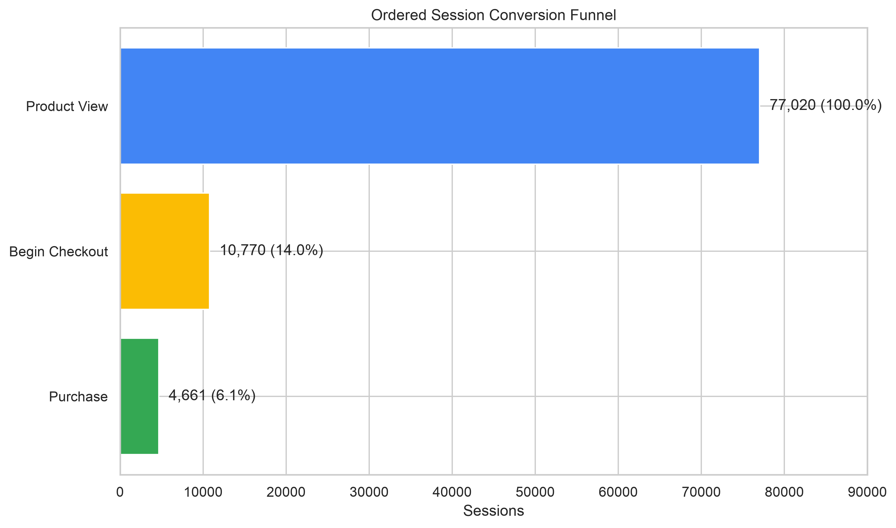
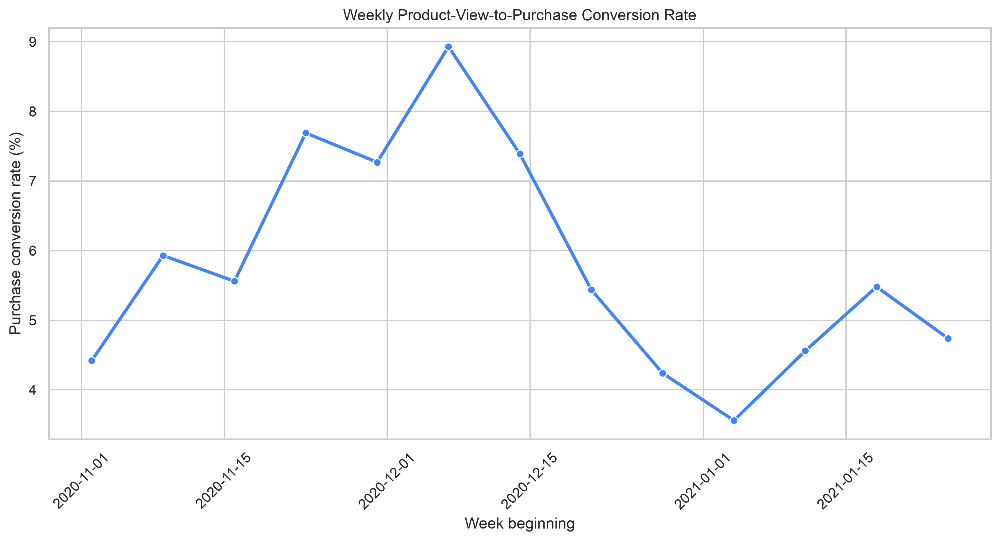
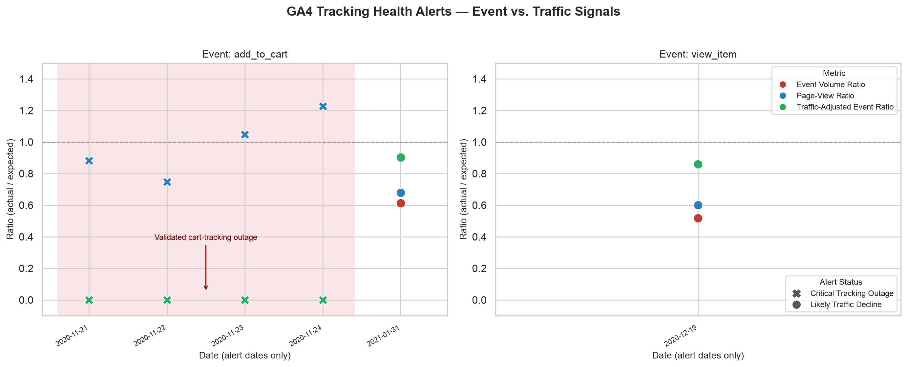
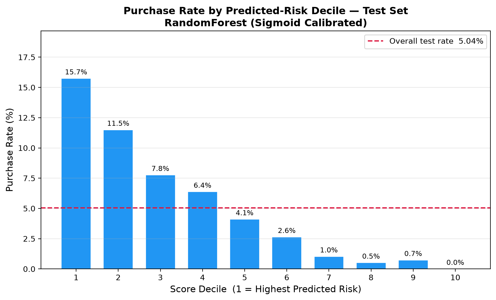

# Google Merchandise Store Funnel Analysis

[](https://github.com/JasonValade/google-store-funnel-analysis/actions/workflows/ci.yml)
[](https://www.python.org/downloads/)
[](https://opensource.org/licenses/MIT)
[](https://github.com/psf/black)
[](https://github.com/astral-sh/ruff)

An end-to-end analytics portfolio project that turns 4.3 million Google Analytics 4 events into funnel insights, tracking-health alerts, and a purchase-propensity model.

[**View the live Streamlit dashboard**](https://app-store-funnel-analysis.streamlit.app/) · [Executive Summary](docs/executive_summary.md) · [Technical Methodology](docs/technical_methodology.md) · [Feature Documentation](docs/feature_documentation.md)



## Project impact

- Analyzed **4,295,584 events** across **360,129 sessions** from the public Google Merchandise Store GA4 export.
- Built a timestamp-validated funnel covering **77,020 product-view sessions** and identified the largest loss between product view and checkout.
- Detected all four manually confirmed `add_to_cart` outage dates with a traffic-adjusted tracking-health monitor.
- Developed a leakage-safe purchase-propensity model with **0.1402 test PR-AUC**, versus a **0.0504 no-skill baseline**.
- Ranked the highest-risk scoring decile at **3.12× lift**, capturing **31.3% of purchases**.
- Built an **ROI & What-If Calculator** for modeling conversion improvements and estimating revenue impact with confidence intervals.
- Implemented **time-series forecasting** for predicting future conversion rates and purchase volumes with seasonal pattern analysis.
- Shipped a nine-page Streamlit dashboard powered by committed, pre-computed artifacts—no credentials or live database required.

## Business question

Where do customers abandon the purchase journey, which segments and products underperform, and can early-session behavior identify visitors who are more likely to purchase?

The project addresses this through six connected workstreams:

1. Ordered session-funnel analysis
2. Device, acquisition, and product segmentation
3. GA4 tracking-health monitoring
4. Session-level purchase-propensity modeling
5. ROI & What-If Calculator for conversion optimization planning
6. Time-series forecasting for predictive analytics and resource planning

## Key findings

### Conversion funnel

| Stage | Sessions | Stage conversion |
|---|---:|---:|
| Product view | 77,020 | — |
| Begin checkout | 10,770 | 13.98% from product view |
| Purchase | 4,661 | 43.28% from checkout |
| **Overall** | — | **6.05%** |

**Note:** The 6.05% overall funnel conversion counts only sessions that completed all four funnel stages in strict timestamp order (view_item → add_to_cart → begin_checkout → purchase). The purchase-propensity model uses a broader definition (purchase strictly after first view_item, regardless of other funnel stages), resulting in 6.09% prevalence. The 27-session difference (4,688 - 4,661) represents sessions that purchased without completing the full ordered funnel. The model's test set has 5.04% prevalence due to temporal drift. See [`reports/model_methodology.md`](reports/model_methodology.md) for detailed population definitions.

The largest opportunity is the product-view-to-checkout transition: **86% of product-view sessions did not begin checkout**.

The clean four-stage cart funnel was limited to dates with reliable `add_to_cart` tracking. During that period, only **34.94% of cart sessions progressed to checkout**.

### Conversion trends and segments

- Weekly purchase conversion peaked at **8.93%** during the week of December 7, 2020, then declined through January.
- Mobile converted at **6.26%**, compared with **5.91%** for desktop. The difference was borderline statistically significant and small in practical terms.
- Direct traffic converted at **5.92%**, Google organic at **5.08%**, and Google CPC at **4.74%**. These fields represent first-user acquisition rather than session-level attribution.
- Several high-traffic products converted at only 1–2%, creating candidates for inventory, tracking, merchandising, and product-page review.



### Tracking health

The monitoring prototype combines a rolling seven-day baseline, event-volume ratio, z-score, page-view context, and traffic-adjusted event ratio.

It correctly surfaced the four manually validated `add_to_cart` outages from November 21–24, when event counts fell to zero despite continued site traffic. It separately classified two broader volume drops as likely traffic declines instead of event-specific tracking failures.



### Purchase propensity

The model predicts whether a purchase will occur later in a session using only information available at the first `view_item` event. A comprehensive methodology report is available at [`reports/model_methodology.md`](reports/model_methodology.md).

| Metric | Test result |
|---|---:|
| PR-AUC | **0.1402** |
| No-skill PR-AUC | 0.0504 |
| ROC-AUC | 0.7876 |
| Calibrated Brier score | 0.0457 |
| Top-decile lift | **3.12×** |
| Purchases captured in top decile | **31.3%** |

The model uses chronological train/validation/test splits to prevent leakage, excludes post-view behavior, and performs calibration and threshold selection on validation data only. See the full methodology report for detailed feature construction, evaluation procedures, and economic decision context.



## Technical approach

| Area | Implementation |
|---|---|
| Data source | `bigquery-public-data.ga4_obfuscated_sample_ecommerce.events_*` |
| Querying | BigQuery Standard SQL with `_TABLE_SUFFIX` cost controls and nested-field handling |
| Funnel logic | Session key from user ID + GA session ID; timestamp-validated stage ordering |
| Analysis | pandas, NumPy, SciPy, statsmodels |
| Modeling | scikit-learn pipelines, logistic regression, random forest, sigmoid calibration |
| Evaluation | Chronological holdout, PR-AUC, ROC-AUC, Brier score, lift, capture rate |
| Visualization | Plotly, Matplotlib, Seaborn |
| Application | Multi-page Streamlit dashboard using local CSV/JSON artifacts |

## Repository structure

```text
.
├── .github/workflows/    # CI/CD pipeline configuration
├── app.py                 # Streamlit Cloud entry point
├── dashboard/            # Nine-page results application
│   ├── pages/           # Dashboard page components
│   └── utils/           # Reusable chart and data-loading utilities
├── data/processed/demo/  # Deployment-safe analytical artifacts
├── docs/                 # Documentation (executive summary, methodology, features)
├── images/               # Exported analysis visuals
├── notebooks/            # Statistical, monitoring, ML, and business analytics workflows
├── sql/                  # BigQuery analysis, feature, and validation queries
├── tests/                # Unit tests for dashboard utilities
├── pyproject.toml       # Modern Python packaging with dev dependencies
├── Dockerfile           # Containerized deployment configuration
├── docker-compose.yml   # Docker Compose orchestration
├── Makefile             # Common development commands
├── .pre-commit-config.yaml # Pre-commit hooks for code quality
└── requirements.txt     # Legacy requirements (for compatibility)
```

Notable files:

- [`sql/05_ordered_session_funnel.sql`](sql/05_ordered_session_funnel.sql) — timestamp-validated funnel
- [`sql/09_model_features.sql`](sql/09_model_features.sql) — leakage-safe feature engineering
- [`sql/12_tracking_health_monitor.sql`](sql/12_tracking_health_monitor.sql) — event-health signals
- [`sql/13_model_feature_validation.sql`](sql/13_model_feature_validation.sql) — feature quality checks
- [`notebooks/03_purchase_prediction.ipynb`](notebooks/03_purchase_prediction.ipynb) — model training and evaluation
- [`notebooks/04_roi_what_if_calculator.ipynb`](notebooks/04_roi_what_if_calculator.ipynb) — ROI & What-If Calculator analysis (NEW)
- [`notebooks/05_time_series_forecasting.ipynb`](notebooks/05_time_series_forecasting.ipynb) — time-series forecasting analysis (NEW)
- [`dashboard/README.md`](dashboard/README.md) — dashboard pages and artifact inputs
- [`dashboard/pages/06_analysis_journey.py`](dashboard/pages/06_analysis_journey.py) — complete analytical walkthrough
- [`dashboard/pages/07_roi_calculator.py`](dashboard/pages/07_roi_calculator.py) — ROI & What-If Calculator dashboard (NEW)
- [`dashboard/pages/08_time_series_forecasting.py`](dashboard/pages/08_time_series_forecasting.py) — time-series forecasting dashboard (NEW)
- [`docs/executive_summary.md`](docs/executive_summary.md) — business-focused summary
- [`docs/executive_presentation.md`](docs/executive_presentation.md) — executive slide deck
- [`docs/visual_story.md`](docs/visual_story.md) — narrative visual walkthrough
- [`docs/ab_testing_framework.md`](docs/ab_testing_framework.md) — A/B testing guide
- [`docs/business_requirements.md`](docs/business_requirements.md) — complete business requirements
- [`docs/project_retrospective.md`](docs/project_retrospective.md) — lessons learned and skills demonstrated
- [`docs/skills_matrix.md`](docs/skills_matrix.md) — comprehensive skills catalog
- [`docs/MODEL_CARD.md`](docs/MODEL_CARD.md) — industry-standard model documentation (NEW)
- [`docs/technical_methodology.md`](docs/technical_methodology.md) — deep technical methodology
- [`docs/feature_documentation.md`](docs/feature_documentation.md) — business feature definitions
- [`tests/test_data_loader.py`](tests/test_data_loader.py) — data loader unit tests
- [`tests/test_charts.py`](tests/test_charts.py) — chart builder unit tests

## Run the dashboard locally

Python 3.11 or newer is recommended.

### Quick start with pip

```bash
git clone https://github.com/JasonValade/google-store-funnel-analysis.git
cd google-store-funnel-analysis

python3 -m venv .venv
source .venv/bin/activate
python -m pip install -e .
python -m streamlit run app.py
```

### Using the Makefile (recommended)

```bash
make install-dev    # Install development dependencies
make run            # Run the Streamlit dashboard
```

Open `http://localhost:8501`. The dashboard uses pre-computed files from `data/processed/demo/`; BigQuery credentials and environment variables are not required.

### Using Docker

```bash
make docker-build   # Build the Docker image
make docker-run     # Run the container
# Or with docker-compose:
make docker-compose-up
```

Open `http://localhost:8501`.

## Reproduce the analysis

The SQL files are numbered in execution order from schema inspection through model-feature validation. BigQuery Sandbox can query the public dataset without storing credentials in this repository.

The purchase-model notebook reads the included compressed feature extract directly:

```bash
python -m jupyter notebook notebooks/03_purchase_prediction.ipynb
```

Do not commit raw exports, service-account files, or credentials. Only small, aggregated, non-sensitive demo artifacts belong in `data/processed/demo/`.

## Development

This project uses modern Python development tooling:

### Code quality

Pre-commit hooks ensure code quality:
```bash
make pre-commit-install  # Install pre-commit hooks
```

Hooks include:
- **Ruff** - Fast Python linter and formatter
- **Black** - Code formatting
- **MyPy** - Static type checking
- **Bandit** - Security linting

Manual checks:
```bash
make lint          # Run all linters
make format        # Format code
make check         # Run all quality checks
```

### Testing
```bash
make test          # Run tests
make test-cov      # Run tests with coverage report
```

### Docker
```bash
make docker-build       # Build Docker image
make docker-run         # Run container
make docker-compose-up  # Run with docker-compose
```

## Documentation

This project includes comprehensive documentation for different audiences:

### 📋 Quick Start
- **[PROJECT_SUMMARY](docs/PROJECT_SUMMARY.md)** - Complete overview with documentation index, metrics, and final assessment

### Business-Focused
- **[Executive Summary](docs/executive_summary.md)** - Business-focused overview with key findings, recommendations, and ROI estimates
- **[Executive Presentation](docs/executive_presentation.md)** - 16-slide deck for executive presentations and stakeholder meetings
- **[Visual Story](docs/visual_story.md)** - Narrative walkthrough with ASCII art visualizations for memorable storytelling
- **[Business Requirements](docs/business_requirements.md)** - Complete business requirements document with success criteria

### Technical-Focused
- **[Technical Methodology](docs/technical_methodology.md)** - Deep dive into the analytical journey, technical decisions, and rationale
- **[Feature Documentation](docs/feature_documentation.md)** - Business-friendly definitions of all model features with interpretation
- **[A/B Testing Framework](docs/ab_testing_framework.md)** - Complete guide for validating recommendations through experiments
- **[Model Card](docs/MODEL_CARD.md)** - Industry-standard model documentation (performance, ethics, deployment) ⭐ NEW

### Project-Focused
- **[Project Retrospective](docs/project_retrospective.md)** - Lessons learned, challenges faced, and skills demonstrated
- **[Skills Matrix](docs/skills_matrix.md)** - Comprehensive catalog of demonstrated skills and competencies

### Reference
- **[Metric Definitions](docs/metric_definitions.md)** - Detailed definitions of business metrics
- **[Data Dictionary](docs/data_dictionary.md)** - Field descriptions and data structure
- **[Model Methodology](reports/model_methodology.md)** - ML-specific details on model development

## Recommendations

- Test ways to reduce product-view and cart-to-checkout friction, including clearer shipping information and a stronger checkout path.
- Audit high-traffic, zero-purchase products for availability, catalog consistency, and instrumentation before treating them as merchandising failures.
- Investigate self-referrals and attribution quality before reallocating acquisition budgets.
- Productionize event-health checks with scheduled queries and automated notifications.
- Monitor model calibration and purchase-rate drift before using propensity scores operationally.

These are testable hypotheses, not causal conclusions. Conversion changes should be evaluated through controlled experiments.

## Limitations

- The public dataset is obfuscated and covers only November 2020 through January 2021.
- `add_to_cart` tracking was unreliable November 1–15 and unavailable November 21–24.
- Acquisition fields describe first-user source/medium, not necessarily the source of each session.
- Product names were normalized because item identifiers were inconsistent across event types.
- The analysis is observational; segment differences and model associations do not establish causality.
- The dashboard is a portfolio application with static artifacts, not a live scoring or production alerting service.

## Author

Jason Valade · [LinkedIn](https://www.linkedin.com/in/jason-valade)
